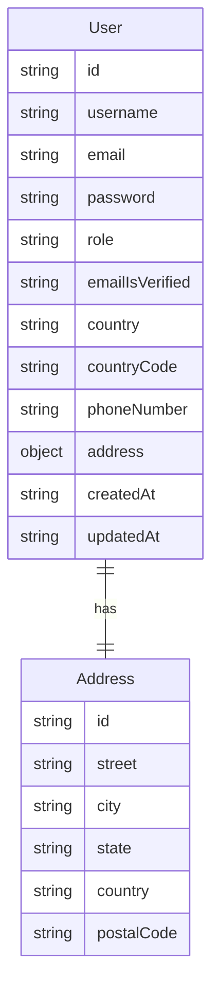

# Entity Relationship Diagram
The following diagram shows the relationship between the entities in the database.

```mermaid
erDiagram
User {
    string id
    string username
    string email
    string password
    string role
    string emailIsVerified
    string country
    string countryCode
    string phoneNumber
    object address
    string createdAt
    string updatedAt
}
Address {
    string id
    string street
    string city
    string state
    string country
    string postalCode
}
User ||--|| Address : has
```